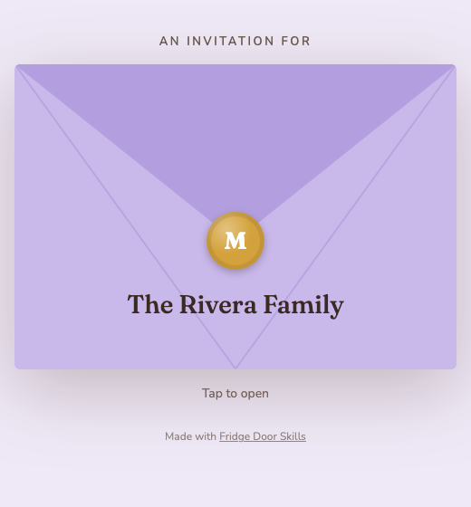
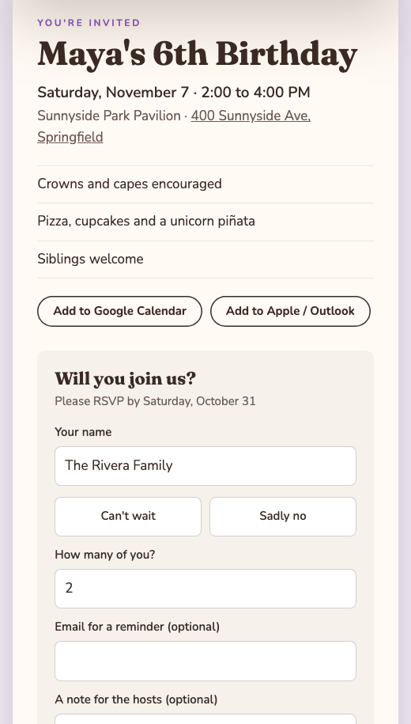
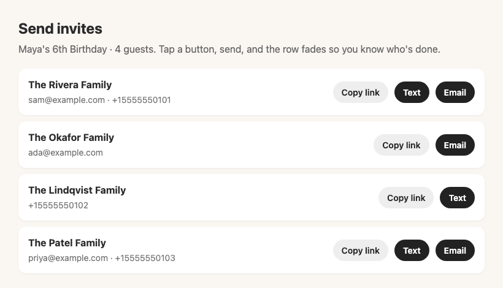

# Fridge Door Skills

**Claude skills for the real-life stuff that ends up on the fridge.** Party invitations first, with more to come: the school forms, family calendars and "who's bringing what" lists that run a household.

Made by a mom who builds software, for anyone running a household. No coding needed.

---

## The skills

### Party Invite
Tell Claude about the party and it makes a custom digital invitation: a sealed envelope with each family's name on it that opens to a designed card, with the details, add-to-calendar buttons, a map link and an RSVP form. It walks you through publishing it free on Netlify, turns your guest list into a personal link for every family, and gives you a page with one-tap **Text** and **Email** buttons to send them all.

It feels like Paperless Post, but the design is whatever you want and the RSVPs are yours.

**[See a live example](https://fridge-door-party-demo.netlify.app/?to=The+Rivera+Family)** (tap the envelope).

<p align="center">
  
  &nbsp;
  
</p>

When your guest list is ready, the skill makes a sending page: every family gets a personal link, and one tap opens a text or email with it already written.

<p align="center">
  
</p>

## How to use a skill

**In the Claude app (desktop or web):**
1. Download `party-invite.skill` from the [latest release](https://github.com/marymckee-dev/fridge-door-skills/releases/latest).
2. In Claude, go to **Settings → Capabilities → Skills** and upload it.
3. Start a chat and say something like *"Make an invite for my daughter's 6th birthday."*

**In Claude Code:**
```
/plugin marketplace add marymckee-dev/fridge-door-skills
/plugin install fridge-door-skills@fridge-door-skills
```

## License

[CC BY-NC 4.0](LICENSE). Use them, share them, change them for your family and friends. Please credit Fridge Door Skills, and don't sell them or bundle them into something you sell. Invitations made with the skill carry a small "Made with Fridge Door Skills" line; you're welcome to remove it from your own invites.

Questions or ideas for the next skill? [Open an issue](https://github.com/marymckee-dev/fridge-door-skills/issues).
